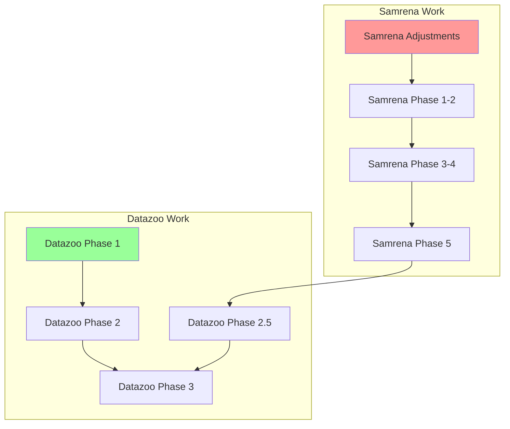

# Ptah Project Master Plan

## Overview
This document provides the high-level roadmap for the Ptah project, coordinating improvements across both samrena (memory arena) and datazoo (hash map) libraries.

## Current Status
- **Date**: 2025-07-30
- **Phase**: Planning adjustments for samrena expansion
- **Next Milestone**: Complete samrena hexagonal architecture design adjustments

## Project Components

### 1. Samrena Library
Memory arena management with upcoming hexagonal architecture expansion.

**Status**: In planning adjustment phase
**Planning**: [samrena/overview.md](samrena/overview.md) | [samrena/expansion_plan.md](samrena/expansion_plan.md)
**Adjustments**: See [samrena/adjustments/](samrena/adjustments/)
**Tasks**: See [samrena/tasks/](samrena/tasks/)

#### Samrena Implementation Phases:
1. **Phase 1**: Core Interface Design (Tasks 01-03)
2. **Phase 2**: Adapter Implementation (Tasks 04-06)
3. **Phase 3**: Platform Detection (Tasks 07-09)
4. **Phase 4**: Factory and Strategy (Tasks 10-12)
5. **Phase 5**: Enhanced Features (Tasks 13-15)
6. **Phase 6**: Testing and Documentation (Tasks 16-19)
7. **Phase 7**: Advanced Features (Task 20+)

### 2. Datazoo Library
Hash map implementation built on samrena.

**Status**: Improvements planned, awaiting samrena adjustments
**Planning**: [datazoo/overview.md](datazoo/overview.md)
**Tasks**: See [datazoo/tasks/](datazoo/tasks/)

#### Datazoo Implementation Phases:
1. **Phase 1**: Quick Fixes (Tasks 01, 02, 11)
2. **Phase 2**: Core Improvements (Tasks 03, 04, 08)
3. **Phase 2.5**: Essential Samrena Features (Tasks 13, 14)
4. **Phase 3**: New Features (Tasks 05, 06, 07)
5. **Phase 3.5**: Additional Samrena Features (Tasks 15-18)
6. **Phase 4**: Advanced Features (Task 09)
7. **Phase 5**: Quality Assurance (Tasks 10, 12)
8. **Phase 6**: Advanced Documentation (Tasks 19, 20)

## Current Priorities

1. **Immediate**: Complete samrena expansion adjustments
2. **Next**: Begin samrena Phase 1 (Core Interface Design)
3. **Then**: Resume datazoo Phase 1 quick fixes (can parallel with samrena work)
4. **Future**: Complete samrena hexagonal architecture before datazoo Phase 2.5

## Dependencies

**Legend**:
- 🔴 Blocked work
- 🟢 Can proceed immediately
- 🟡 Partially blocked

## Change Management

All planning changes are tracked in:
- [PLANNING_CHANGELOG.md](PLANNING_CHANGELOG.md) - High-level change log
- Individual adjustment files in component directories

## Review Schedule

- Weekly: Update task status
- Bi-weekly: Review dependencies and blockers
- Monthly: Reassess priorities and timeline