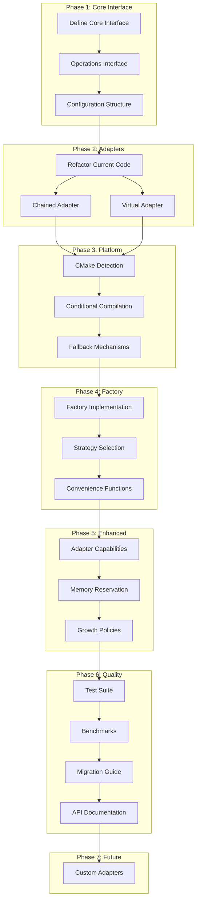

# Samrena Expansion Plan Overview

This directory contains the planning and implementation tasks for expanding
samrena from a simple memory arena to a flexible, hexagonal architecture
supporting multiple allocation strategies.

## Current Architecture
Samrena currently provides a basic memory arena with:
- Fixed page size allocation
- Simple push/push_zero operations
- Basic memory tracking

## Target Architecture
Hexagonal architecture with pluggable adapters:
- **Port**: Unified interface for all allocation strategies
- **Adapters**: Multiple backend implementations (chained pages, virtual memory)
- **Strategy Selection**: Runtime or compile-time adapter selection

## Task Order and Dependencies

### Phase 1: Core Interface Design
- **[01_define_core_interface.md](tasks/01_define_core_interface.md)** - Design the hexagonal port interface
- **[02_operations_interface.md](tasks/02_operations_interface.md)** - Define SamrenaOps structure
- **[03_configuration_structure.md](tasks/03_configuration_structure.md)** - Unified configuration system

### Phase 2: Adapter Implementation
- **[04_refactor_current_implementation.md](tasks/04_refactor_current_implementation.md)** - Convert existing code to chained adapter
- **[05_implement_chained_adapter.md](tasks/05_implement_chained_adapter.md)** - Complete chained pages adapter
- **[06_implement_virtual_adapter.md](tasks/06_implement_virtual_adapter.md)** - Add virtual memory adapter

### Phase 3: Platform Detection
- **[07_cmake_platform_detection.md](tasks/07_cmake_platform_detection.md)** - Build system capability detection
- **[08_conditional_compilation.md](tasks/08_conditional_compilation.md)** - Platform-specific code paths
- **[09_fallback_mechanisms.md](tasks/09_fallback_mechanisms.md)** - Graceful degradation

### Phase 4: Factory and Strategy
- **[10_implement_factory.md](tasks/10_implement_factory.md)** - Main creation function
- **[11_strategy_selection.md](tasks/11_strategy_selection.md)** - Runtime adapter selection
- **[12_convenience_functions.md](tasks/12_convenience_functions.md)** - Backward compatibility

### Phase 5: Enhanced Features
- **[13_adapter_capabilities.md](tasks/13_adapter_capabilities.md)** - Query adapter features
- **[14_memory_reservation.md](tasks/14_memory_reservation.md)** - Optional reserve operation
- **[15_growth_policies.md](tasks/15_growth_policies.md)** - Configurable expansion

### Phase 6: Testing and Documentation
- **[16_adapter_test_suite.md](tasks/16_adapter_test_suite.md)** - Comprehensive testing
- **[17_performance_benchmarks.md](tasks/17_performance_benchmarks.md)** - Compare adapter performance
- **[18_migration_guide.md](tasks/18_migration_guide.md)** - Help users upgrade
- **[19_api_documentation.md](tasks/19_api_documentation.md)** - Complete reference docs

### Phase 7: Advanced Features (Future)
- **[20_custom_adapters_guide.md](tasks/20_custom_adapters_guide.md)** - Enable user adapters

## Implementation Strategy

### Priority Order
1. **Essential**: Phases 1-4 (Core functionality)
2. **Important**: Phase 5 (Enhanced features)
3. **Quality**: Phase 6 (Testing and docs)
4. **Future**: Phase 7 (Extensibility)

### Risk Mitigation
- Maintain backward compatibility through convenience functions
- Default to portable chained adapter
- Extensive testing on multiple platforms
- Clear migration documentation

## Dependencies

### External Dependencies
- Platform APIs for virtual memory (Windows: VirtualAlloc, POSIX: mmap)
- CMake 3.10+ for build configuration

### Internal Dependencies
- No dependencies on other Ptah libraries
- Must remain foundation library

## Success Criteria

1. **Compatibility**: Existing code continues to work unchanged
2. **Performance**: Virtual adapter matches or exceeds current performance
3. **Portability**: Works on all major platforms
4. **Flexibility**: Easy to add new adapters
5. **Simplicity**: Clean, understandable API

## Phase Diagram

## Notes

- Each task is designed to be implementable in 1-2 hours
- Tasks within a phase can often be done in parallel
- Regular testing throughout implementation
- Documentation updates with each phase
